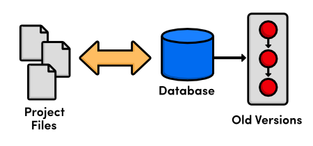
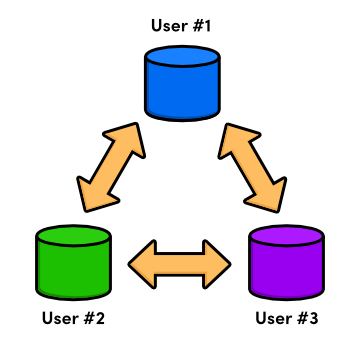

# مقدمه

گیت یک سیستم کنترل نسخه (version control system VCS) است که برای یک کار ساخته شده است: مدیریت تغییرات در فایل های شما. این به شما امکان می‌دهد هر تغییری را که یک پروژه نرم‌افزاری طی می‌کند و همچنین چطور خواهد شد، ردیابی کنید. این امر Git را به ابزاری ضروری برای مدیریت پروژه‌های بزرگ تبدیل می‌کند، اما بجز این می‌تواند طیف وسیعی از امکانات را برای گردش کار شخصی شما باز کند.

## تاریخچه مختصری از Version Control System

ما در این لحظه بیشتر در مورد فلسفه اصلی پشت Git صحبت خواهیم کرد، اما ابتدا، اجازه دهید به طور کلی تکامل سیستم های کنترل نسخه را مرور کنیم.

## فایل ها و پوشه ها

قبل از ظهور نرم افزار کنترل ویرایش، فقط فایل ها و پوشه ها وجود داشتند. تنها راه برای ردیابی ویرایش های یک پروژه، کپی کردن کل پروژه و دادن یک نام جدید به آن بود. فقط به این فکر کنید که چند بار یک "backup" به نام my-term-paper-2.doc را ذخیره کرده اید. این ساده ترین شکل کنترل نسخه است.


\
\
اما، به راحتی می توان دید که چگونه کپی کردن فایل ها از پوشه ای به پوشه دیگر می تواند برای توسعه دهندگان نرم افزار فاجعه بار باشد. اگر یک پوشه را اشتباه برچسب گذاری کنید چه اتفاقی می افتد؟ یا اگر فایل اشتباهی را بازنویسی کنید؟ از کجا می دانید که یک قطعه مهم از کد را از دست داده اید؟ دیری نپایید که توسعه دهندگان نرم افزار متوجه شدند که به چیزی قابل اعتمادتر نیاز دارند.

## سیستم کنترل نسخه محلی

بنابراین، توسعه‌دهندگان شروع به نوشتن برنامه‌های کاربردی کردند که به مدیریت ویرایش فایل‌ها اختصاص داشت. این VCS های جدید به جای نگهداری نسخه های قدیمی به عنوان فایل های مستقل، آنها را در یک پایگاه داده ذخیره می کردند. هنگامی که نیاز داشتید به نسخه قدیمی نگاه کنید، به جای دسترسی مستقیم به فایل، از VCS استفاده ‌می‌کردید. به این ترتیب، شما فقط یک نسخه از پروژه را در هر زمان مشخص خواهید داشت که امکان اختلاط یا از دست دادن ویرایش ها را از بین می برد.


\
\
در این مرحله، نسخه‌سازی فقط در رایانه _local_ توسعه‌دهنده انجام می‌شد – هیچ راهی برای اشتراک‌گذاری مؤثر کد بین چندین برنامه‌نویس وجود نداشت.

## مرکزی VCS

وارد سیستم کنترل نسخه متمرکز (CVCS) شوید. این برنامه های جدید CVCS به جای ذخیره تاریخچه پروژه در هارد دیسک توسعه دهنده، همه چیز را در یک سرور ذخیره می کنند. توسعه‌دهندگان فایل‌ها را بررسی کرده و آنها را از طریق شبکه در پروژه ذخیره می‌کردند. این تنظیمات به چندین برنامه نویس اجازه می دهد تا با دادن یک single point of entry به آنها در یک پروژه همکاری کنند.


\
در حالی که یک پیشرفت بزرگ در VCS محلی، سیستم های متمرکز مجموعه جدیدی از مشکلات را ارائه کردند: چگونه چندین کاربر به طور همزمان روی یک فایل کار می کنند؟ فقط سناریویی را تصور کنید که در آن دو نفر یک باگ را رفع می کنند و سعی می کنند به روز رسانی های خود را به سرور مرکزی ارسال کنند. تغییرات چه کسی را باید پذیرفت؟
\
\
CVCS با جلوگیری از نادیده گرفتن کار دیگران توسط کاربران، این مشکل را برطرف کرد. اگر دو تغییر تضاد داشتند، شخصی باید به صورت دستی وارد می شد و تفاوت ها را ادغام می کرد. این راه‌حل برای پروژه‌هایی با به‌روزرسانی‌های نسبتاً کم کار می‌کرد (که به معنای تداخل نسبتاً کمی بود)، اما برای پروژه‌هایی با ده‌ها مشارکت‌کننده فعال که روزانه چندین به‌روزرسانی را ارسال می‌کردند، دست و پا گیر بود: توسعه نمی‌توانست ادامه یابد تا زمانی که همه تداخل‌های ادغام برطرف نشده و در دسترس کل تیم توسعه قرار گیرد.

## ورژن کنترل سیستم توضیع شده

نسل بعدی برنامه‌های revision control از ایده یک مخزن متمرکز، منحرف شده و به جای آن تصمیم گرفتند به هر توسعه‌دهنده نسخه _local_ خود را از کل پروژه بدهند. شبکه توزیع شده (Distributed) مخازن به هر توسعه‌دهنده اجازه می‌دهد در انزوا کار کند، بسیار شبیه به یک VCS محلی – اما اکنون مشکل حل تعارض CVCS راه‌حل بسیار زیباتری دارد.


\
\
از آنجایی که دیگر یک مخزن مرکزی وجود نداشت، هرکسی می‌توانست با سرعت خودش توسعه دهد، به‌روزرسانی‌ها را به صورت محلی ذخیره کند، و merging conflictها را تا زمانی که راحت باشد به تعویق بیاندازد. علاوه بر این، سیستم‌های کنترل نسخه توزیع‌شده (DVCS) بر مدیریت کارآمد برای شاخه‌های (branchs) جداگانه توسعه، متمرکز شدند که اشتراک‌گذاری کد، merging conflictها و آزمایش ایده‌های جدید را بسیار آسان‌تر کرد.
\
\
ماهیت محلی DVCSها نیز توسعه را بسیار سریعتر کرده است، زیرا دیگر نیازی به انجام اقدامات روی شبکه نیست. و از آنجایی که هر کاربر یک کپی کامل از پروژه داشت، خطر خرابی سرور، مخزن خراب یا هر نوع دیگر از دست دادن داده بسیار کمتر از CVCS قبلی آنها بود.

## تولد گیت

 خب، به Git رسیدیم، که یک distributed version control system است که برای مدیریت هسته لینوکس ایجاد شده. در سال 2005، جامعه لینوکس مجوز رایگان خود را به نرم افزار BitKeeper، یک DVCS تجاری که از سال 2002 استفاده می کرد، از دست داد. در جواب لینوس توروالدز از توسعه یک DVCS منبع باز جدید به عنوان جایگزین حمایت کرد. این تولد گیت بود.

 به عنوان یک مدیر سورس کد برای کل هسته لینوکس، Git چندین محدودیت منحصر به فرد داشت، از جمله:

- قابلیت اطمینان
- مدیریت کارآمد پروژه های بزرگ
- پشتیبانی از توسعه توزیع شده
- پشتیبانی از توسعه غیر خطی

در حالی که DVCS های دیگری در آن زمان وجود داشتند (مانند GNU’s Arch یا دارک های David Roundy’s Darcs)، هیچ یک از آنها نمی توانستند این ترکیب از ویژگی ها را برآورده کنند. با پیشبرد این اهداف، Git چندین سال است که فعال و در حال توسعه بوده است و اکنون از ثبات، محبوبیت و مشارکت اجتماعی زیادی برخوردار است.

گیت به عنوان یک برنامه خط فرمان ایجاد شد، اما رابط های بصری مختلفی در طول سال ها منتشر شده است. ابزارهای گرافیکی برخی از پیچیدگی‌های پشت Git را پنهان می‌کنند و اغلب تجسم وضعیت یک مخزن را آسان‌تر می‌کنند، اما همچنان به یک پایه محکم در کنترل نسخه توزیع‌شده نیاز دارند. با در نظر گرفتن این موضوع، ما به رابط خط فرمان، که هنوز رایج ترین راه برای تعامل با Git است، پایبند خواهیم بود.

## نصب و راه اندازی

در لینوکس:

```bash
# ubuntu or debian
sudo apt install git-all
# RHEL-based
sudo yum install git-all
```

در MacOS:

```bash
brew install git
```

در ویندوز برای دانلود به [این لینک](https://git-scm.com/download/win) مراجعه کنید.

